<div style="display:inline-block"><br>
  <h1>Racha Pedido</h1> 
  
    
  
</div>

---
[](https://www.linkedin.com/in/diego-neves-224208177/)
[](https://github.com/diegosneves/racha-pedido/actions/workflows/ci-main.yaml)
[](https://wakatime.com/badge/user/018bea20-dbbc-48e2-b101-5415903acf5a/project/018c82f7-5a74-4411-851f-68e7b0bdc2a7)

O **Racha Pedido** é uma solução inteligente para resolver o desafio comum enfrentado por equipes de trabalho ao dividir
lanches ou refeições solicitados por meio de aplicativos de entrega como iFood ou Uber Eats.

---

## Swagger

- [Swagger - Local](http://localhost:8080/swagger-ui/index.html)
- [Api - Docs](http://localhost:8080/v3/api-docs)

---
## Email de Notificação:
Uma nova funcionalidade foi implementada na API que faz uma requisição a um serviço externo com o intuito de emitir notificações para todos os participantes de uma divisão, com exceção da pessoa que realizou a compra. Para a verificação dos emails, recomendamos a utilização de geradores de emails temporários, como:

- [Temp-mail](https://temp-mail.org/pt/view/61f43a53d76123be1478ba0b)

Contudo, fique à vontade para escolher e usar qualquer outro serviço de geração de emails temporários de sua preferência.

---

### Instalação:

```yaml
version: '3.9'

services:
  email_server:
    image: diegoneves/email-server:latest
    restart: always
    container_name: email_server
    networks:
      - pedido-bridge
    ports:
      - "8081:8081"

  racha-pedido-app:
    image: diegoneves/racha-pedido:latest
    container_name: racha-pedido
    ports:
      - "8080:8080"
    depends_on:
      - email_server
    networks:
      - pedido-bridge
    environment:
      - EMAIL_HOST=email_server
      - EMAIL_PORT=8081


networks:
  pedido-bridge:
    driver: bridge
```

Lembre-se de estar no diretório onde o seu arquivo `docker-compose.yaml` está localizado antes de executar esses comandos.

Para executar esse arquivo docker-compose.yaml, use o comando:
```shell
docker-compose up -d
```

Se quiser que o Docker Compose reconstrua as imagens antes de iniciar os contêineres, você pode adicionar a opção --build:
```shell
docker-compose up --build -d
```

Para `parar` o `docker-compose.yaml` execute o comando abaixo:
```shell
docker-compose down
```

Para `parar` e `remover` as imagens associadas ao `docker-compose`, execute o comando abaixo:

```shell
docker-compose down --rmi all
```

---

## Modelo de Request:

```json
{
    "buyer": {
        "personName": "Fulano",
        "email": "seu.email@email.com",
        "items": [
            {
                "name": "Hamburguer",
                "price": 40
            },
            {
                "name": "Sobremesa",
                "price": 2
            }
        ]
    },
    "selectedBank": "picpay",
    "splitInvoiceWith": [
        {
            "personName": "Amigo",
            "email": "seu.email@email.com",
            "items": [
                {
                    "name": "Sanduíche",
                    "price": 8
                }
            ]
        }
    ],
    "discountType": "cash",
    "discount": 20,
    "deliveryFee": 8
}
```

---

### UML:

```mermaid
classDiagram
direction BT
class BankAccount {
<<enumeration>>
  - BankAccount(String, String) 
  +  NUBANK
  +  PICPAY
  - String bankName
  - String billingLink
  + toString() String
  + paymentLink(Double) String
}
class BillSplit {
  + BillSplit(List~InvoiceDTO~, Double) 
  + BillSplit() 
  - Double totalPayable
  - List~InvoiceDTO~ invoices
  + getInvoices() List~InvoiceDTO~
  + getTotalPayable() Double
  + setInvoices(List~InvoiceDTO~) void
  + setTotalPayable(Double) void
  + builder() BillSplitBuilder
}
class BuilderMapper {
<<Interface>>
  + builderMapper(Class~T~, Object) T
  + builderMapper(Class~T~, E, BuildingStrategy~T, E~) T
}
class BuildingStrategy~T, E~ {
<<Interface>>
  + run(E) T
}
class BuyerPersonMapper {
  + BuyerPersonMapper() 
  + run(PersonDTO) Person
}
class CalculateInvoiceException {
  + CalculateInvoiceException(String) 
  + CalculateInvoiceException(String, Throwable) 
  + ErroHandler ERROR
}
class CashDiscountStrategy {
  + CashDiscountStrategy() 
  + calculateDiscount(Person, Double, DiscountType, Double, Double) Invoice
}
class ConstructorDefaultUndefinedException {
  + ConstructorDefaultUndefinedException(String, Throwable) 
  + ErroHandler ERROR
}
class ControllerExceptionHandler {
  + ControllerExceptionHandler() 
  + generalError(Exception) ResponseEntity~ExceptionDTO~
  + mapperRelatedFaileures(MapperFailureException) ResponseEntity~ExceptionDTO~
  + mapperRelatedFaileures(ConstructorDefaultUndefinedException) ResponseEntity~ExceptionDTO~
  + orderRelatedFaileures(CalculateInvoiceException) ResponseEntity~ExceptionDTO~
  + consumerRelatedFaileures(PersonConstraintsException) ResponseEntity~ExceptionDTO~
}
class CorsConfig {
  + CorsConfig() 
  + corsFilter() CorsFilter
}
class DiscountStrategy {
  + DiscountStrategy() 
  # DiscountStrategy next
  + calculateDiscount(Person, Double, DiscountType, Double, Double) Invoice
  # checkNext(Person, Double, DiscountType, Double, Double) Invoice
  + link(DiscountStrategy, DiscountStrategy[]) DiscountStrategy
}
class DiscountType {
<<enumeration>>
  - DiscountType(Double) 
  - Double calculation
  +  PERCENTAGE
  +  CASH
  +  NO_DISCOUNT
  + discountAmount(Double) Double
}
class EmailService {
  + EmailService(SendEmailAdapter, JavaMailSender, SpringTemplateEngine) 
  - JavaMailSender emailSender
  - SpringTemplateEngine templateEngine
  - String EMAIL_TEMPLATE
  - SendEmailAdapter sendEmailAdapter
  - Logger log
  + sendPaymentEmail(NotificationEmail) void
  + sendEmail(NotificationEmail) void
}
class EmailServiceContract {
<<Interface>>
  + sendPaymentEmail(NotificationEmail) void
  + sendEmail(NotificationEmail) void
}
class ErroHandler {
<<enumeration>>
  - ErroHandler(String, HttpStatus) 
  +  CONSTRUCTOR_DEFAULT_UNDEFINED
  +  EMAIL_SEND_FAILURE
  +  PERSON_CONSTRAINTS
  - String message
  +  CLASS_MAPPING_FAILURE
  +  INVOICE_FAILED
  - HttpStatus httpStatus
  +  ORDER_FAILED
  + getStatusCodeValue() int
  + errorMessage(String) String
  + getHttpStatusCode() HttpStatus
}
class ExceptionDTO {
  + ExceptionDTO(String, int) 
  - int statusCode
  - String message
  + message() String
  + statusCode() int
}
class HttpAdapter {
  # HttpAdapter() 
  # RestTemplateSimpleWebClient restTemplateSimpleWebClient
  # HttpHeaders headers
  # getRestTemplateSimpleWebClient() RestTemplateSimpleWebClient
  # getHeaders() HttpHeaders
  # setRestTemplateSimpleWebClient(RestTemplateSimpleWebClient) void
  # setHeaders(HttpHeaders) void
}
class Invoice {
  + Invoice() 
  + Invoice(String, String, Boolean, List~Item~, Double, Double, String) 
  - Boolean isBuyer
  - String email
  - Double percentageConsumedTotalBill
  - Double totalPayable
  - String paymentLink
  - List~Item~ items
  - String consumerName
  + setItems(List~Item~) void
  + getConsumerName() String
  + getEmail() String
  + getIsBuyer() Boolean
  + setPercentageConsumedTotalBill(Double) void
  + getItems() List~Item~
  + getTotalPayable() Double
  + getPercentageConsumedTotalBill() Double
  + setPaymentLink(String) void
  + getPaymentLink() String
  + setIsBuyer(Boolean) void
  + setConsumerName(String) void
  + setTotalPayable(Double) void
  + builder() InvoiceBuilder
  + setEmail(String) void
}
class InvoiceDTO {
  + InvoiceDTO(String, List~Item~, Double, String) 
  + InvoiceDTO() 
  - Double totalPayable
  - List~Item~ items
  - String consumerName
  - String paymentLink
  + getConsumerName() String
  + getItems() List~Item~
  + getTotalPayable() Double
  + getPaymentLink() String
  + setConsumerName(String) void
  + setItems(List~Item~) void
  + setTotalPayable(Double) void
  + setPaymentLink(String) void
  + builder() InvoiceDTOBuilder
}
class InvoiceFromPersonMapper {
  + InvoiceFromPersonMapper() 
  + run(Person) Invoice
}
class InvoiceService {
  + InvoiceService(EmailServiceContract) 
  - String CALCULATION_ERROR_MESSAGE
  - String NULL_PARAMETER_ERROR_MESSAGE
  - String VOID
  - EmailServiceContract emailService
  - preparateSendingEmailNotification(List~Invoice~, BankAccount) List~NotificationEmail~
  - calcDiscountForInvoice(Person, DiscountType, Double, Double, Double) Invoice
  - convertToInvoiceDTO(Invoice) InvoiceDTO
  - statementForPayment(List~Invoice~, BankAccount, List~NotificationEmail~) BillSplit
  + generateInvoice(List~Person~, DiscountType, Double, Double, BankAccount) BillSplit
  - validateParameters(List~Person~, DiscountType, Double, Double) void
  - calculateDiscount(List~Person~, DiscountType, Double, Double) List~Invoice~
}
class InvoiceServiceContract {
<<Interface>>
  + generateInvoice(List~Person~, DiscountType, Double, Double, BankAccount) BillSplit
}
class Item {
  + Item(String, Double) 
  + Item() 
  - Double price
  - String name
  + getName() String
  + getPrice() Double
  + setName(String) void
  + setPrice(Double) void
  + builder() ItemBuilder
}
class MapperFailureException {
  + MapperFailureException(String, Throwable) 
  + ErroHandler ERROR
}
class NoDiscountStrategy {
  + NoDiscountStrategy() 
  + calculateDiscount(Person, Double, DiscountType, Double, Double) Invoice
}
class NotificationEmail {
  + NotificationEmail(String, String, Double, List~Item~, String, String) 
  + NotificationEmail() 
  - String email
  - Double total
  - String bank
  - String consumerName
  - List~Item~ itens
  - String link
  + getItens() List~Item~
  + getEmail() String
  + setItens(List~Item~) void
  + equals(Object) boolean
  + builder() NotificationEmailBuilder
  + toString() String
  + setLink(String) void
  + getConsumerName() String
  + getTotal() Double
  + getBank() String
  + setBank(String) void
  + getLink() String
  + setTotal(Double) void
  + setEmail(String) void
  # canEqual(Object) boolean
  + setConsumerName(String) void
  + hashCode() int
}
class NotificationEmailMapper {
  + NotificationEmailMapper() 
  + run(Invoice) NotificationEmail
}
class OpenApiConfig {
  + OpenApiConfig() 
  + customOpenAPI() OpenAPI
  - getTags() List~Tag~
  - getInfo() Info
}
class PercentageDiscountStrategy {
  + PercentageDiscountStrategy() 
  + calculateDiscount(Person, Double, DiscountType, Double, Double) Invoice
}
class Person {
  + Person(String, String, Boolean, List~Item~) 
  + Person() 
  - List~Item~ items
  - String email
  - Boolean isBuyer
  - String personName
  + getPersonName() String
  + getEmail() String
  + getIsBuyer() Boolean
  + getItems() List~Item~
  + setPersonName(String) void
  + setEmail(String) void
  + setIsBuyer(Boolean) void
  + setItems(List~Item~) void
  + builder() PersonBuilder
}
class PersonConstraintsException {
  + PersonConstraintsException(String) 
  + ErroHandler ERROR
}
class PersonDTO {
  + PersonDTO(String, String, List~Item~) 
  + PersonDTO() 
  - String email
  - String personName
  - List~Item~ items
  + getPersonName() String
  + getEmail() String
  + getItems() List~Item~
  + setPersonName(String) void
  + setEmail(String) void
  + setItems(List~Item~) void
  + builder() PersonDTOBuilder
}
class PersonService {
  + PersonService() 
  - String EMAIL_MISSING_ERROR_MESSAGE
  - String BUYER_ERROR
  - String MISSING_NAME_ERROR_MESSAGE
  + getConsumers(PersonDTO, List~PersonDTO~) List~Person~
  - convertToPerson(PersonDTO) Person
  - convertAllConsumersToPerson(List~PersonDTO~) List~Person~
  - convertBuyerToPerson(PersonDTO) Person
  - validatePersonData(PersonDTO) PersonDTO
}
class PersonServiceContract {
<<Interface>>
  + getConsumers(PersonDTO, List~PersonDTO~) List~Person~
}
class RachaPedidoApplication {
  + RachaPedidoApplication() 
  + main(String[]) void
}
class RestTemplateSimpleWebClient {
  + RestTemplateSimpleWebClient() 
  - RestTemplate restTemplate
  + getRestTemplate() RestTemplate
}
class RoundUtil {
  - RoundUtil() 
  + round(Double) Double
}
class SendEmailAdapter {
  + SendEmailAdapter(String) 
  - String url
  - Logger log
  + sendNotificationEmail(NotificationEmail) void
}
class SplitInvoiceController {
  + SplitInvoiceController(SplitInvoiceService) 
  - SplitInvoiceServiceContract service
  + splitInvoice(SplitInvoiceRequest) ResponseEntity~SplitInvoiceResponse~
}
class SplitInvoiceControllerContract {
<<Interface>>
  + splitInvoice(SplitInvoiceRequest) ResponseEntity~SplitInvoiceResponse~
}
class SplitInvoiceRequest {
  + SplitInvoiceRequest(PersonDTO, BankAccount, List~PersonDTO~, DiscountType, Double, Double) 
  + SplitInvoiceRequest() 
  - DiscountType discountType
  - Double discount
  - Double deliveryFee
  - BankAccount selectedBank
  - PersonDTO buyer
  - List~PersonDTO~ splitInvoiceWith
  + getBuyer() PersonDTO
  + setDiscount(Double) void
  + setDeliveryFee(Double) void
  + getSelectedBank() BankAccount
  + getSplitInvoiceWith() List~PersonDTO~
  + getDiscountType() DiscountType
  + getDiscount() Double
  + setDiscountType(DiscountType) void
  + getDeliveryFee() Double
  + setBuyer(PersonDTO) void
  + setSelectedBank(BankAccount) void
  + builder() SplitInvoiceRequestBuilder
  + setSplitInvoiceWith(List~PersonDTO~) void
}
class SplitInvoiceResponse {
  + SplitInvoiceResponse(List~InvoiceDTO~, Double) 
  + SplitInvoiceResponse() 
  - List~InvoiceDTO~ invoices
  - Double totalPayable
  + getInvoices() List~InvoiceDTO~
  + getTotalPayable() Double
  + setInvoices(List~InvoiceDTO~) void
  + setTotalPayable(Double) void
  + builder() SplitInvoiceResponseBuilder
}
class SplitInvoiceService {
  + SplitInvoiceService(PersonServiceContract, InvoiceServiceContract) 
  - InvoiceServiceContract invoiceService
  - PersonServiceContract personService
  + splitInvoice(SplitInvoiceRequest) SplitInvoiceResponse
}
class SplitInvoiceServiceContract {
<<Interface>>
  + splitInvoice(SplitInvoiceRequest) SplitInvoiceResponse
}
class ThymeLeafContextUtil {
  - ThymeLeafContextUtil() 
  - Context context
  - String CONTEXT_GENERATION_ERROR
  - Logger log
  + generateBy(T) Context
}
class WebSecurityConfig {
  + WebSecurityConfig() 
  + securityFilterChain(HttpSecurity) SecurityFilterChain
}

BillSplit "1" *--> "invoices *" InvoiceDTO 
BuilderMapper  ..>  BuildingStrategy~T, E~ 
BuilderMapper  ..>  ConstructorDefaultUndefinedException 
BuilderMapper  ..>  MapperFailureException 
BuyerPersonMapper  ..>  BuildingStrategy~T, E~ 
BuyerPersonMapper  ..>  Person 
BuyerPersonMapper  ..>  PersonDTO 
CalculateInvoiceException "1" *--> "ERROR 1" ErroHandler 
CashDiscountStrategy  ..>  BuilderMapper 
CashDiscountStrategy  -->  DiscountStrategy 
CashDiscountStrategy  ..>  DiscountType 
CashDiscountStrategy  ..>  Invoice 
CashDiscountStrategy  ..>  InvoiceFromPersonMapper 
CashDiscountStrategy  ..>  Item 
CashDiscountStrategy  ..>  Person 
CashDiscountStrategy  ..>  RoundUtil 
ConstructorDefaultUndefinedException "1" *--> "ERROR 1" ErroHandler 
ControllerExceptionHandler  ..>  CalculateInvoiceException 
ControllerExceptionHandler  ..>  ConstructorDefaultUndefinedException 
ControllerExceptionHandler  ..>  ErroHandler 
ControllerExceptionHandler  ..>  ExceptionDTO 
ControllerExceptionHandler  ..>  MapperFailureException 
ControllerExceptionHandler  ..>  PersonConstraintsException 
DiscountStrategy  ..>  DiscountType 
DiscountStrategy  ..>  Invoice 
DiscountStrategy  ..>  Person 
EmailService  ..>  EmailServiceContract 
EmailService  ..>  NotificationEmail 
EmailService "1" *--> "sendEmailAdapter 1" SendEmailAdapter 
EmailService  ..>  ThymeLeafContextUtil 
EmailServiceContract  ..>  NotificationEmail 
HttpAdapter "1" *--> "restTemplateSimpleWebClient 1" RestTemplateSimpleWebClient 
Invoice "1" *--> "items *" Item 
InvoiceDTO "1" *--> "items *" Item 
InvoiceFromPersonMapper  ..>  BuildingStrategy~T, E~ 
InvoiceFromPersonMapper  ..>  Invoice 
InvoiceFromPersonMapper  ..>  Person 
InvoiceService  ..>  BankAccount 
InvoiceService  ..>  BillSplit 
InvoiceService  ..>  BuilderMapper 
InvoiceService  ..>  CalculateInvoiceException 
InvoiceService  ..>  CashDiscountStrategy 
InvoiceService  ..>  DiscountStrategy 
InvoiceService  ..>  DiscountType 
InvoiceService "1" *--> "emailService 1" EmailServiceContract 
InvoiceService  ..>  Invoice 
InvoiceService  ..>  InvoiceDTO 
InvoiceService  ..>  InvoiceServiceContract 
InvoiceService  ..>  Item 
InvoiceService  ..>  NoDiscountStrategy 
InvoiceService  ..>  NotificationEmail 
InvoiceService  ..>  NotificationEmailMapper 
InvoiceService  ..>  PercentageDiscountStrategy 
InvoiceService  ..>  Person 
InvoiceServiceContract  ..>  BankAccount 
InvoiceServiceContract  ..>  BillSplit 
InvoiceServiceContract  ..>  DiscountType 
InvoiceServiceContract  ..>  Person 
MapperFailureException "1" *--> "ERROR 1" ErroHandler 
NoDiscountStrategy  ..>  BuilderMapper 
NoDiscountStrategy  -->  DiscountStrategy 
NoDiscountStrategy  ..>  DiscountType 
NoDiscountStrategy  ..>  Invoice 
NoDiscountStrategy  ..>  InvoiceFromPersonMapper 
NoDiscountStrategy  ..>  Item 
NoDiscountStrategy  ..>  Person 
NoDiscountStrategy  ..>  RoundUtil 
NotificationEmail "1" *--> "itens *" Item 
NotificationEmailMapper  ..>  BuildingStrategy~T, E~ 
NotificationEmailMapper  ..>  Invoice 
NotificationEmailMapper  ..>  NotificationEmail 
PercentageDiscountStrategy  ..>  BuilderMapper 
PercentageDiscountStrategy  -->  DiscountStrategy 
PercentageDiscountStrategy  ..>  DiscountType 
PercentageDiscountStrategy  ..>  Invoice 
PercentageDiscountStrategy  ..>  InvoiceFromPersonMapper 
PercentageDiscountStrategy  ..>  Item 
PercentageDiscountStrategy  ..>  Person 
PercentageDiscountStrategy  ..>  RoundUtil 
Person "1" *--> "items *" Item 
PersonConstraintsException "1" *--> "ERROR 1" ErroHandler 
PersonDTO "1" *--> "items *" Item 
PersonService  ..>  BuilderMapper 
PersonService  ..>  BuyerPersonMapper 
PersonService  ..>  Person 
PersonService  ..>  PersonConstraintsException 
PersonService  ..>  PersonDTO 
PersonService  ..>  PersonServiceContract 
PersonServiceContract  ..>  Person 
PersonServiceContract  ..>  PersonConstraintsException 
PersonServiceContract  ..>  PersonDTO 
SendEmailAdapter  ..>  ErroHandler 
SendEmailAdapter  -->  HttpAdapter 
SendEmailAdapter  ..>  NotificationEmail 
SendEmailAdapter  ..>  RestTemplateSimpleWebClient 
SplitInvoiceController  ..>  SplitInvoiceControllerContract 
SplitInvoiceController  ..>  SplitInvoiceRequest 
SplitInvoiceController  ..>  SplitInvoiceResponse 
SplitInvoiceController  ..>  SplitInvoiceService 
SplitInvoiceController "1" *--> "service 1" SplitInvoiceServiceContract 
SplitInvoiceControllerContract  ..>  SplitInvoiceRequest 
SplitInvoiceControllerContract  ..>  SplitInvoiceResponse 
SplitInvoiceRequest "1" *--> "selectedBank 1" BankAccount 
SplitInvoiceRequest "1" *--> "discountType 1" DiscountType 
SplitInvoiceRequest "1" *--> "splitInvoiceWith *" PersonDTO 
SplitInvoiceResponse "1" *--> "invoices *" InvoiceDTO 
SplitInvoiceService  ..>  BillSplit 
SplitInvoiceService  ..>  BuilderMapper 
SplitInvoiceService "1" *--> "invoiceService 1" InvoiceServiceContract 
SplitInvoiceService  ..>  Person 
SplitInvoiceService "1" *--> "personService 1" PersonServiceContract 
SplitInvoiceService  ..>  SplitInvoiceRequest 
SplitInvoiceService  ..>  SplitInvoiceResponse 
SplitInvoiceService  ..>  SplitInvoiceServiceContract 
SplitInvoiceServiceContract  ..>  SplitInvoiceRequest 
SplitInvoiceServiceContract  ..>  SplitInvoiceResponse 

```

